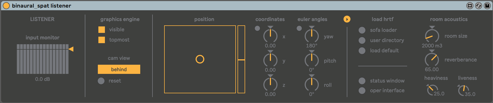
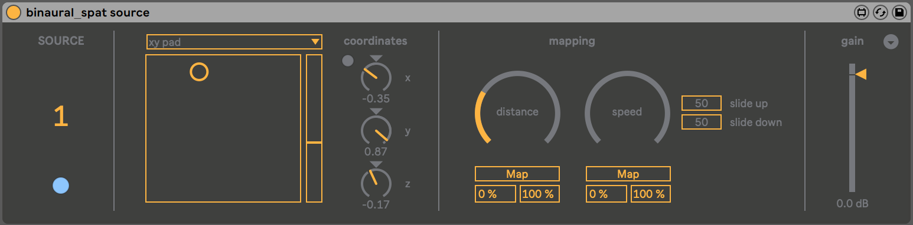
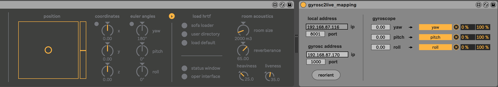

# binaural_spat

## About
binaural_spat is a collection of Max for Live devices for binaural spatialisation in Ableton Live using [IRCAM's Spat5 Library](https://forum.ircam.fr/projects/detail/spat/). binaural_spat makes use of new multichannel routing capabilities in [Live 10](https://www.ableton.com) and [Max for Live](https://www.ableton.com/en/live/max-for-live/). Before continuing, make sure to have both installed. 

The current version is still being tested, so if you encounter any issues on Windows or Mac, please report back to me. 
## Installation
When you clone the repository, make sure to leave the Max for Live devices in the downloaded folder. This ensures that other included files (i.e. 3D head model) gets loaded correctly when setting up a Live Set. 

## First steps
### Add binaural_spat listener
Create a new audio track in Ableton and add the 'binaural_spat listener'-device. The track will automatically get renamed 'listener'. This track will act as the receiver of audio from up to 16 'binaural_spat source'-devices. Here you can also monitor the input from the source devices. 

By default the listener device loads a built-in KEMAR-HRTF. Clicking 'sofa loader' will bring up the included Sofa Loader interface from the Spat5 Library. Here you can choose and download HRTF-files from existing databases in order to get a better result. 

### Add binaural_spat sources
Create a new audio or midi track and add the 'binaural_spat source'-device. When loading a source-device you are asked to give the device a number (between 1-16). Make sure not to load two source devices on one track, and always give numbers in the correct order. 

The source device takes a stereo input and converts it to mono. The mono signal is automatically routed to the corresponding input in the listener-device. 

Note that adding a source-device to a track will automatically set the track to "Sends only". This is done because the audio gets routed internally to the listener-device. 

You can add up to 16 source devices (although 16 is not recommended due to high CPU load).

### Head-tracking capabilities
The listener-device is ready for setting up a head-tracking system. As an experimental feature, I have included the device 'gyrosc2live' which enables OSC (Open Sound Control) communication between the iOS app [GyrOSC](http://www.bitshapesoftware.com/instruments/gyrosc/) and the listener-device. The gyrosc2live-device receives gyroscope data from the app (preferably installed on an iPhone) and makes it easy to map euler angles (pitch, yaw, roll) to the 'pitch', 'yaw', and 'roll' parameters in the listener device. When the app and device is set up, place the iPhone on top of your head and click 'reorient'. By moving your head around you should be able to see/hear the result accordingly. 

In order to setup more complex head-tracking systems with position and head-orientation, you can create a similar Max for Live device and map the data to position (x, y, z coordinates) and euler-angles inside the listener-device.
